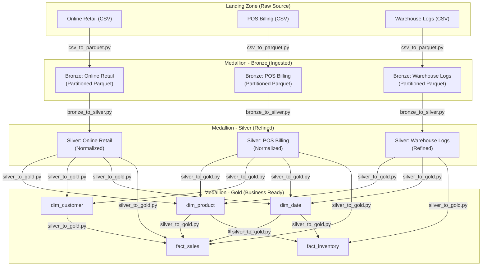

# Data Flow and Separation Diagram

This document outlines the data movement and transformation logic across the three layers of the Medallion Architecture (Bronze, Silver, Gold).

## Data Flow Diagram

---

## Separation and Cleaning Steps

### 1. Bronze Layer (Landing to Ingested)
**Script**: `csv_to_parquet.py`
**Goal**: Convert raw files into a stable, queryable format while preserving the original raw data structure.

**Cleaning Steps**:
*   **Format Conversion**: Converts raw CSV and Excel files to Parquet for improved compression and performance.
*   **Header Mapping**: Applies standard headers to raw files (Online Retail, POS Billing, Warehouse Inventory) during ingestion.
*   **Date Normalization**: 
    *   Casts timestamp columns (`InvoiceDate`, `BillDate`, `EventDate`) to proper `datetime` objects.
    *   Drops rows where the primary timestamp is missing.
*   **Hive Partitioning**: Extracts `year`, `month`, and `day` from timestamps to create a directory-based partition structure (`/year=YYYY/month=MM/day=DD`).

### 2. Silver Layer (Ingested to Refined)
**Script**: `bronze_to_silver.py`
**Goal**: Clean, deduplicate, and normalize data from different sources into a common structure using DuckDB ELT.

**Cleaning Steps (Online Retail - ERP)**:
*   **Normalization**: Trims IDs and forces uppercase on codes.
*   **Cancellation Check**: Detects cancellations via 'C' prefix in `invoice_id`.
*   **Deduplication**: Filters exact duplicates using `ROW_NUMBER()` over `invoice_id`, `product_id`, `quantity`, and `order_timestamp`.

**Cleaning Steps (POS Billing - In-Store)**:
*   **Synonym Mapping**: Maps POS-specific terms (`BillNo`, `ItemCode`, `Rate`) to unified Silver names (`invoice_id`, `product_id`, `unit_price`).
*   **Type Casting**: Ensures numeric fields (`quantity`, `unit_price`, `cost_price`) are properly typed.
*   **Deduplication**: Removes POS duplicates based on the bill transaction details.

**Cleaning Steps (Warehouse Logs - WMS)**:
*   **SKU Normalization**: Forces consistency on `product_id` and `movement_type`.
*   **Log Deduplication**: Ensures each `log_id` is unique in the Silver layer.

### 3. Gold Layer (Refined to Business Ready)
**Script**: `silver_to_gold.py`
**Goal**: Transform cleaned tables into a Unified Star Schema optimized for analytics and KPI calculation.

**Transformation Steps**:
*   **Unified Dimensions**:
    *   **dim_product**: Unions all unique products from ERP, POS, and WMS sources. Assigns a surrogate `product_key`.
    *   **dim_customer**: Unions customers from Online and POS channels. Assigns a surrogate `customer_key`.
    *   **dim_date**: Generates a date spine covering all transactions, including `is_weekend` flags and integer `date_key`.
*   **Fact Table Construction**:
    *   **fact_sales**: Combines normalized transactions from Online + POS. Joins with Dimensions to replace business IDs with Surrogate Keys. Generates an MD5 `sales_key`.
    *   **fact_inventory**: Links warehouse movements to unified products and dates for inventory turnover analysis.
*   **Partitioning**: Fact tables remain partitioned by `year`, `month`, and `day` for efficient time-series querying.
