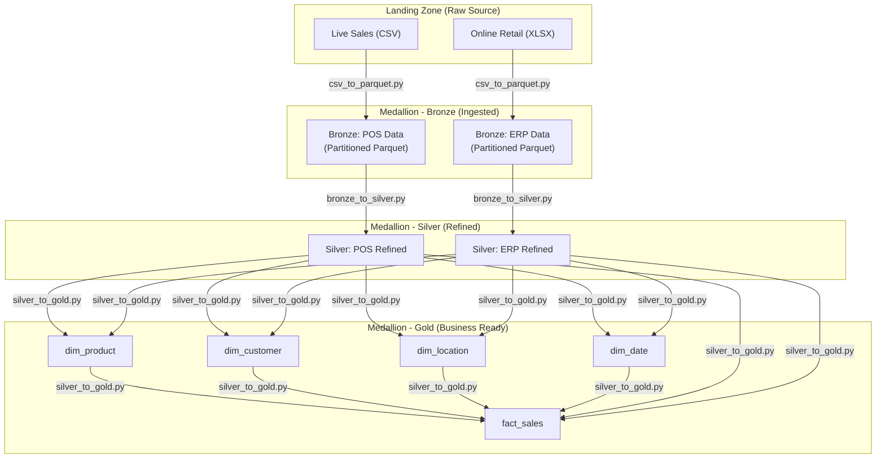

# Data Flow and Separation Diagram

This document outlines the data movement and transformation logic across the three layers of the Medallion Architecture (Bronze, Silver, Gold).

## Data Flow Diagram

---

## Separation and Cleaning Steps

### 1. Bronze Layer (Landing to Ingested)
**Script**: `csv_to_parquet.py`
**Goal**: Convert raw files into a stable, queryable format while preserving the original raw data structure.

**Cleaning Steps**:
*   **Format Conversion**: Converts raw CSV and Excel files to Parquet for improved compression and performance.
*   **Type Forcing**: For Excel files, object-type columns (like descriptions) are forced to strings to prevent down-stream schema mismatches.
*   **Date Normalization**: 
    *   Casts timestamp/invoice columns to proper `datetime` objects.
    *   Drops any rows where the timestamp is missing or invalid.
*   **Hive Partitioning**: Extracts `year`, `month`, and `day` from timestamps to create a directory-based partition structure (`/year=2024/month=01/...`).

### 2. Silver Layer (Ingested to Refined)
**Script**: `bronze_to_silver.py`
**Goal**: Clean, deduplicate, and normalize data from different sources into a common structure.

**Cleaning Steps (POS Data)**:
*   **Type Casting**: Explicitly casts ID columns (order, store, customer) to VARCHAR.
*   **Source Tagging**: Adds `source_system` ('pos') for downstream lineage tracking.
*   **Status Mapping**: Computes an `is_cancelled` boolean flag based on the `order_status` text.
*   **Latest-Event Deduplication**: Uses a window function to keep only the latest record for each `order_id` based on the timestamp.

**Cleaning Steps (ERP Data)**:
*   **Column Mapping**: Renames technical source columns to business-friendly names (e.g., `Invoice` -> `invoice_id`).
*   **Handling Nulls**: Fills missing `customer_id` values with the string `'Unknown'`.
*   **Feature Engineering**: Calculates the `total_amount` (`Quantity * Price`) on the fly.
*   **Row-Level Deduplication**: Removes exact duplicates based on the combination of invoice, product, quantity, and date.

### 3. Gold Layer (Refined to Business Ready)
**Script**: `silver_to_gold.py`
**Goal**: Transform cleaned tables into a Star Schema (Fact and Dimension tables) optimized for analytics.

**Transformation Steps**:
*   **Unified Dimensions**:
    *   Unions records from both POS and ERP systems to create single sources of truth for Products, Customers, and Locations.
    *   Generates **Surrogate Keys** (`product_key`, `customer_key`, etc.) to decouple analytics from source-system IDs.
*   **Date Spine Generation**: 
    *   Creates a `dim_date` table covering all dates present in the data.
    *   Adds business logic like `is_holiday` (calculated based on weekend rules).
*   **Fact Table Construction**:
    *   Joins refined Silver data with the new Dimension tables.
    *   Normalizes metrics (e.g., calculates `discount_amount` consistently across sources).
    *   Generates a global `sales_key` (MD5 hash) to uniquely identify jede sales transaction across the entire enterprise.
*   **Final Partitioning**: The large `fact_sales` table is re-partitioned by date for high-performance time-series analysis.
