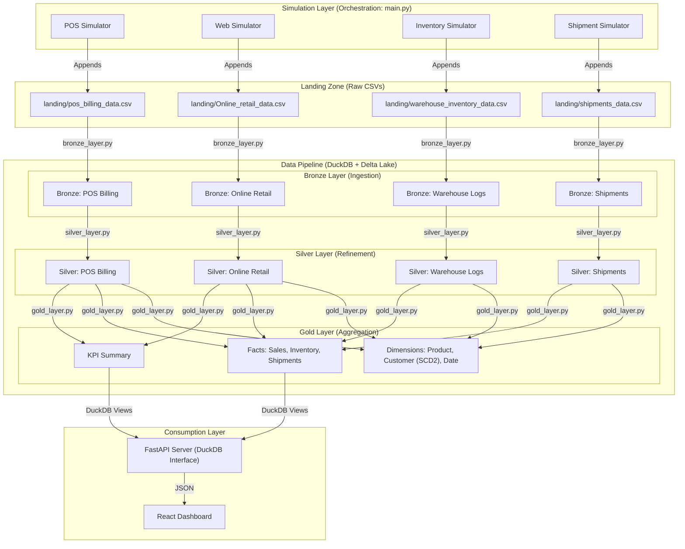

# RetailSink Project Documentation

## 1. Data Flow Overview

The RetailSink project simulates a real-time retail analytics platform. Data flows from a simulation engine through a Medallion Architecture pipeline to a consumption layer (API & Dashboard).

### End-to-End Data Flow

---

## 2. Pipeline Scripts & Implementation

The pipeline is split into three main scripts, orchestrated by `main.py` based on a "Virtual Time" clock.

### i. Ingestion: `pipeline/bronze_layer.py`
**Trigger:** Every 60 seconds (Live).
**Goal:** Stabilize raw text data into queryable Delta tables.

*   **Process**:
    *   Reads incremental data from `landing/*.csv` using a custom **Checkpoints System** (`data/pipeline_checkpoints.json`).
    *   It tracks the number of lines processed for each file to only read *new* lines (simulating streaming ingestion).
    *   **Transformation**:
        *   Converts string timestamps to Python Datetime objects.
        *   Drops rows with invalid timestamps.
        *   Adds Hive Partition columns (`year`, `month`, `day`).
    *   **Output**: Appends data to `medallion/bronze/{dataset}` in Delta Lake format.

### ii. Refinement: `pipeline/silver_layer.py`
**Trigger:** Immediately after Bronze completion.
**Goal:** Clean, Deduplicate, and Normalize.

*   **Process**:
    *   Uses **DuckDB** to execute SQL queries on Bronze Delta tables.
    *   **Incremental Processing**: Tracks the Delta Lake `version` of the source Bronze tables. Only processes new versions since the last run.
    *   **Queries**:
        *   **Standardization**: specific logic like `REGEXP_REPLACE` to clean Invoice IDs (removing 'C' prefix).
        *   **Type Casting**: Converts string fields (`UnitPrice`, `Quantity`) to proper numeric types.
        *   **Deduplication**: Uses `QUALIFY ROW_NUMBER() OVER(...)` to keep only the latest unique record if duplicates exist in source.
    *   **Output**: Merges (Upsert) data into `medallion/silver/{dataset}` Delta tables.

### iii. Aggregation: `pipeline/gold_layer.py`
**Trigger:** Every 5 minutes (Chunk).
**Goal:** Build a Star Schema for Business Analytics.

*   **Process**:
    *   Transforms Silver data into **Dimensions** and **Facts**.
    *   **Dimensions**:
        *   `dim_product`: Unions products from POS, Web, and Warehouse. Assigns Surrogate Keys.
        *   `dim_customer`: **SCD Type 2** implementation (see Section 4). Unions customers from POS and Web.
        *   `dim_date`: Generated date spine for temporal analysis.
    *   **Facts**:
        *   `fact_sales`: Joins Sales data with Dimensions to replace natural IDs (e.g., `CustomerID`) with Surrogate Keys (`customer_key`). Deduplicates and standardizes schema.
        *   `fact_inventory` & `fact_shipments`: Similar transformation logic linking to Dimensions.
    *   **Output**: Merges data into `medallion/gold/{table}`.

---

## 3. Design Choices

### Why ELT (Extract, Load, Transform) over ETL?
*   **Performance**: We load raw data quickly into the Bronze layer (Delta Lake) before doing heavy processing. This creates a stable backup of raw history.
*   **Flexibility**: Transformations are done via SQL (DuckDB) on top of the Data Lake. If business logic changes, we can re-run transformations from the raw Bronze layer without needing to re-ingest from the source.
*   **Modern Architecture**: Decouples storage (Delta/Parquet) from compute (DuckDB/Python), allowing them to scale independently.

### Why Medallion Architecture?
*   **Bronze (Raw)**: Preserves the original state of data. Allows for auditing and debugging ingestion issues.
*   **Silver (Clean)**: Provides a trusted, single version of truth. Handles messy data issues (nulls, duplicates, formatting) once, so downstream users don't have to.
*   **Gold (Curated)**: Optimized for read-heavy analytics. The Star Schema (Facts/Dims) simplifies complex joins for the API/Dashboard.

### Why Delta Lake & Parquet?
*   **ACID Transactions**: Prevents readers (API) from seeing partial writes while the pipeline is updating tables.
*   **Time Travel**: Delta Lake allows us to query older versions of the data, which is useful for debugging pipeline failures.
*   **Performance**: Parquet is a columnar storage format, highly compressed and optimized for analytical queries (OLAP) which aggregate large columns of data (e.g., `SUM(Revenue)`).

---

## 4. Implementation Details: SCD Type 2 (Slowly Changing Dimensions)

We implemented **SCD Type 2** for the `dim_customer` table to track changes in customer attributes (City, Country) over time without losing history.

*   **Scenario**: A customer moves from 'London' to 'Paris'.
*   **Logic in `gold_layer.py`**:
    1.  **Staging**: Detects changes by comparing incoming Silver data with the current Gold state.
    2.  **Logic**:
        *   If a customer exists and their city changes:
            *   **UPDATE** the old record: Set `is_current = false` and `valid_to = {new_timestamp}`.
            *   **INSERT** a new record: Set `is_current = true`, `valid_from = {new_timestamp}`, `valid_to = NULL`, and generate a new `customer_key`.
    3.  **Result**: The Facts table links to the specific `customer_key` that was valid *at the time of the sale*, preserving accurate historical reporting.

---

## 5. Technology Stack: Why DuckDB & SQL?

### Why DuckDB?
*   **In-Process OLAP**: DuckDB runs inside the Python process (no external server required). It offers performance comparable to Spark/Snowflake for datasets of this size but with zero operational overhead.
*   **SQL Native**: Allows expressing complex transformations (Joins, Windows Functions, Aggregations) in standard SQL, which is more readable and maintainable than complex Pandas chains for data engineers.
*   **Ecosystem Integration**: Native fast read/write support for Parquet and Delta Lake.

### Why SQL Queries over Python (Pandas)?
*   **Declarative vs Imperative**: SQL describes *what* data we want, allowing the engine (DuckDB) to optimize *how* to get it (predicate pushdown, vectorized execution). Pandas requires manual optimization of memory and execution order.
*   **Scalability**: DuckDB can handle datasets larger than RAM (out-of-core processing), whereas Pandas strictly requires the entire dataframe to fit in memory.
*   **Standard**: SQL is the universal language of data engineering, making the pipeline easier to understand for any data professional.
